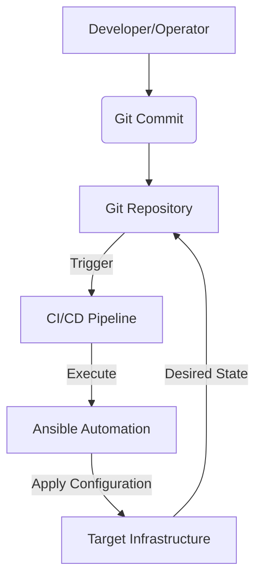

# Infrastructure Automation Framework: Ansible, GitOps, and CI/CD

## 1. Introduction

This document provides a comprehensive overview of an infrastructure automation framework designed to streamline the provisioning, configuration, and deployment of infrastructure and applications. It integrates **Ansible** for robust configuration management, **GitOps** principles for declarative infrastructure, and **CI/CD pipelines** for automated delivery and deployment. The goal is to achieve a highly automated, reliable, and auditable infrastructure management process.

## 2. Core Principles

This framework is built upon the following foundational principles:

*   **Git as the Single Source of Truth:** All infrastructure configurations, application definitions, and operational procedures are meticulously version-controlled within Git repositories. This approach ensures a complete audit trail, facilitates collaboration, and provides a single, reliable source for all infrastructure states.
*   **Idempotency:** Ansible playbooks and roles are engineered to be idempotent. This means that executing them multiple times will consistently result in the same desired state without introducing unintended side effects, making operations predictable and safe.
*   **Declarative Configuration:** Infrastructure is defined declaratively, focusing on *what* the desired state should be rather than *how* to achieve it. This simplifies management and reduces the complexity associated with imperative scripting.
*   **Automation First:** Manual interventions are minimized across the entire infrastructure lifecycle. Automated processes handle provisioning, configuration, deployment, and even self-healing, significantly reducing human error and increasing operational efficiency.
*   **Continuous Integration/Continuous Delivery (CI/CD):** Automated pipelines are central to this framework. They are responsible for validating, testing, and deploying infrastructure changes, accelerating the delivery of new features and ensuring the stability of existing systems.

## 3. Architectural Overview

The infrastructure automation architecture is composed of several interconnected components that work in harmony to achieve automated infrastructure management:

*   **Git Repository:** Serves as the central hub for all infrastructure code, including Ansible playbooks, GitOps manifests, and CI/CD pipeline definitions. All changes originate here.
*   **Ansible Automation Platform (or Ansible Core):** Utilized for configuration management, provisioning of new infrastructure, and orchestration of complex deployment tasks across various environments.
*   **CI/CD Pipeline:** Orchestrates the entire automated workflow, from linting and testing code changes to applying infrastructure updates and deploying applications.
*   **GitOps Operator (e.g., ArgoCD, Flux):** For Kubernetes environments, a GitOps operator continuously monitors the Git repository for changes in declarative manifests and automatically reconciles the live state of the cluster to match the desired state defined in Git.
*   **Target Infrastructure:** Represents the various environments (e.g., development, staging, production) where the infrastructure is provisioned, configured, and applications are deployed.



## 4. Project Structure

The project repository is organized to promote modularity, reusability, and a clear separation of concerns, facilitating easy navigation and maintenance.

```
.git/
├── ansible/
│   ├── playbooks/
│   │   ├── site.yml
│   │   ├── provision_server.yml
│   │   └── deploy_application.yml
│   ├── roles/
│   │   ├── common/
│   │   │   ├── tasks/
│   │   │   └── defaults/
│   │   ├── webserver/
│   │   │   ├── tasks/
│   │   │   └── templates/
│   │   └── database/
│   │       ├── tasks/
│   │       └── handlers/
│   ├── inventory/
│   │   ├── production
│   │   ├── staging
│   │   └── development
│   ├── group_vars/
│   │   ├── all.yml
│   │   ├── webservers.yml
│   │   └── databases.yml
│   └── ansible.cfg
├── gitops/
│   ├── environments/
│   │   ├── production/
│   │   │   └── k8s_manifests/
│   │   ├── staging/
│   │   │   └── k8s_manifests/
│   │   └── development/
│   │       └── k8s_manifests/
│   └── applications/
│       ├── app1/
│       │   └── k8s_manifests/
│       └── app2/
│           └── k8s_manifests/
├── ci-cd/
│   ├── .github/
│   │   └── workflows/
│   │       ├── ansible_ci.yml
│   │       └── gitops_deploy.yml
│   └── .gitlab-ci.yml
├── README.md
└── .gitignore
```

### 4.1. Ansible Directory (`ansible/`)

This directory contains all Ansible-related files:

*   **`playbooks/`**: Houses the main Ansible playbooks (e.g., `site.yml`) that define the desired state of the infrastructure. These playbooks orchestrate the execution of various roles and tasks.
*   **`roles/`**: Contains reusable Ansible roles, each encapsulating a specific component or service (e.g., `common`, `webserver`, `database`, `monitoring`). Roles are structured with subdirectories for `tasks/`, `defaults/`, `handlers/`, and `templates/` to promote modularity and reusability.
*   **`inventory/`**: Defines the hosts and groups of hosts managed by Ansible, typically separated by environment (e.g., `production`, `staging`, `development`).
*   **`group_vars/`**: Stores variables specific to groups of hosts, enabling environment-specific configurations and sensitive data management (often encrypted with Ansible Vault).
*   **`ansible.cfg`**: The primary configuration file for Ansible.

### 4.2. GitOps Directory (`gitops/`)

This directory is dedicated to GitOps configurations, primarily for Kubernetes environments:

*   **`environments/`**: Contains environment-specific configurations, such as Kubernetes manifests or ArgoCD Application definitions, which are applied by a GitOps operator.
*   **`applications/`**: Holds base application configurations, often Kubernetes manifests, that are deployed into the respective environments.

### 4.3. CI/CD Directory (`ci-cd/`)

This directory defines the Continuous Integration and Continuous Delivery pipelines:

*   **`.github/workflows/`**: Contains GitHub Actions workflow definitions (e.g., `ansible-ci.yml` for linting and syntax checks, `gitops-deploy.yml` for triggering GitOps deployments).
*   **`.gitlab-ci.yml`**: Defines GitLab CI pipelines for similar automation tasks.

## 5. GitOps Strategy and Implementation

GitOps is an operational framework that extends DevOps best practices to infrastructure management. It uses Git as the single source of truth for declarative infrastructure and applications.

### 5.1. Core Components

*   **Git Repository:** The definitive source for all infrastructure and application configurations.
*   **GitOps Operator:** Tools like ArgoCD or Flux continuously monitor the Git repository. They detect any divergence between the desired state (in Git) and the actual state (in the environment) and automatically reconcile them.
*   **Declarative Manifests:** These are typically Kubernetes YAML files, Terraform configurations, or Ansible playbooks that describe the desired state of the infrastructure and applications.

### 5.2. GitOps Workflow

1.  **Code Change:** A developer or operator initiates a change by pushing a commit to the Git repository (e.g., updating an Ansible playbook or a Kubernetes manifest).
2.  **CI Validation:** A Continuous Integration pipeline automatically runs to validate the proposed changes, performing linting, syntax checks, and potentially dry-runs.
3.  **Merge to Main:** Once validated and reviewed (e.g., via a Pull Request), the change is merged into the designated `main` branch.
4.  **Reconciliation:** The GitOps operator, continuously polling the Git repository, detects the new commit.
5.  **Automated Sync:** The operator automatically applies the changes to the target environment, ensuring that the live infrastructure matches the state defined in Git.

### 5.3. Benefits of GitOps

*   **Consistency:** Eliminates configuration drift across environments by enforcing the desired state defined in Git.
*   **Reliability:** Enables easy and reliable rollbacks by simply reverting Git commits.
*   **Visibility:** Every change to the infrastructure is tracked in Git history, providing a clear audit trail and enhanced transparency.
*   **Security:** Reduces the need for direct access to production environments, as changes are applied by automated operators based on Git commits.

## 6. Advanced Configuration: Secrets Management and Environment Overlays

### 6.1. Secrets Management

Securely managing sensitive information such as passwords, API keys, and certificates is paramount.

*   **Ansible Vault:** For Ansible-managed secrets, Ansible Vault provides a robust solution to encrypt sensitive data within playbooks or variable files. It allows encryption of individual variables, entire files, or even parts of files.
    *   **Encrypting a file:** `ansible-vault encrypt group_vars/all/secrets.yml`
    *   **Running a playbook with vault:** `ansible-playbook site.yml --ask-vault-pass`
*   **External Secret Stores:** For enhanced security and centralized management, integration with dedicated secret management tools is recommended, especially for production environments:
    *   **HashiCorp Vault:** Ansible can integrate with HashiCorp Vault using the `community.hashi_vault` collection to fetch secrets dynamically at runtime.
    *   **Cloud Provider Secret Managers:** Services like AWS Secrets Manager or Azure Key Vault can be integrated using their respective Ansible modules.
    *   **Kubernetes Secrets with GitOps:** For Kubernetes, tools like **Sealed Secrets** or **External Secrets Operator** enable secure management of Kubernetes Secrets within Git repositories, preventing sensitive data from being stored in plain text.

### 6.2. Environment Overlays with Kustomize

When deploying applications to Kubernetes across multiple environments, **Kustomize** is an effective tool for managing environment-specific configurations without duplicating base manifests. It allows for customization of Kubernetes resources through overlays.

*   **Structure Example:**
    ```
    gitops/applications/app1/
    ├── base/
    │   ├── deployment.yaml
    │   ├── service.yaml
    │   └── kustomization.yaml
    └── overlays/
        ├── production/
        │   ├── kustomization.yaml
        │   └── replica_count.yaml
        └── staging/
            ├── kustomization.yaml
            └── debug_settings.yaml
    ```
*   **Example `overlays/production/kustomization.yaml`:**
    ```yaml
    apiVersion: kustomize.config.k8s.io/v1beta1
    kind: Kustomization
    resources:
      - ../../base
    patchesStrategicMerge:
      - replica_count.yaml
    ```

### 6.3. Monitoring and Observability

Integrating monitoring and observability into the automation framework is crucial for maintaining visibility into the health, performance, and operational status of the infrastructure and applications.

*   **Infrastructure Monitoring:**
    *   **Prometheus & Grafana:** Ansible roles can be used to deploy and configure Prometheus exporters (e.g., `node_exporter`) on all managed hosts, allowing for comprehensive metric collection and visualization in Grafana.
    *   **ELK Stack (Elasticsearch, Logstash, Kibana):** Automation can include the deployment and configuration of agents like Filebeat and Logstash for centralized log collection and analysis.
*   **CI/CD Monitoring:**
    *   Monitor pipeline success rates, deployment frequency, and lead time using built-in analytics provided by CI/CD platforms like GitHub Actions or GitLab CI.
    *   Configure webhooks to send real-time pipeline status notifications to communication platforms such as Slack or Microsoft Teams.

## 7. Conclusion

This infrastructure automation framework, built on Ansible, GitOps, and CI/CD, provides a robust, scalable, and secure approach to managing modern infrastructure. By adhering to principles of Git as the single source of truth, idempotency, and declarative configuration, organizations can achieve faster deployments, reduced operational overhead, and improved system reliability. The detailed project structure and advanced configuration options for secrets management, environment overlays, and monitoring ensure a comprehensive solution for diverse infrastructure needs.
