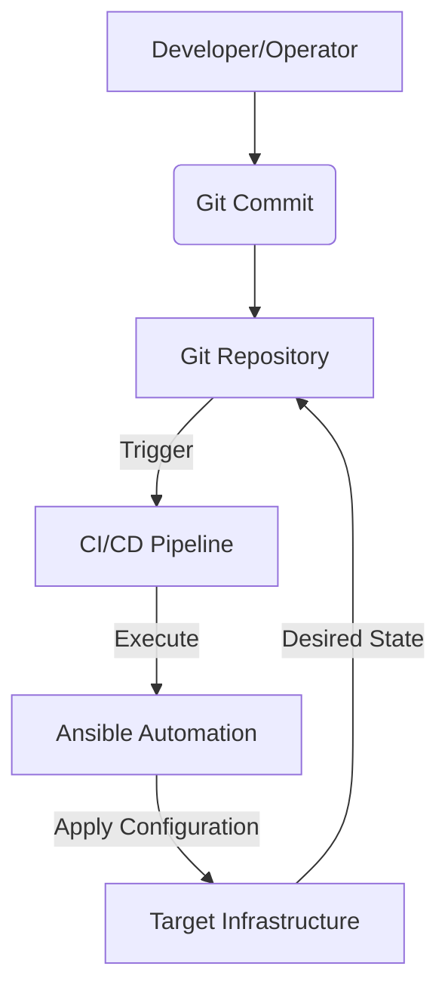

# Infrastructure Automation Architecture: Ansible, GitOps, and CI/CD

## 1. Introduction

This document outlines the architectural design and project structure for a comprehensive infrastructure automation framework. The framework leverages Ansible for configuration management, GitOps principles for declarative infrastructure, and CI/CD pipelines for automated delivery and deployment.

## 2. Core Principles

*   **Git as the Single Source of Truth:** All infrastructure configurations are stored in Git repositories. Changes to the infrastructure are initiated via Git commits, providing version control, auditability, and a clear history of all modifications.
*   **Idempotency:** Ansible playbooks and roles are designed to be idempotent, ensuring that running them multiple times yields the same desired state without unintended side effects.
*   **Declarative Configuration:** Infrastructure is defined declaratively, specifying the desired state rather than a sequence of imperative commands.
*   **Automation First:** Manual interventions are minimized, with automated processes handling provisioning, configuration, and deployment.
*   **Continuous Integration/Continuous Delivery (CI/CD):** Automated pipelines validate, test, and deploy infrastructure changes, accelerating delivery and reducing human error.

## 3. Architectural Overview

The infrastructure automation architecture consists of the following key components:

*   **Git Repository:** The central hub for all infrastructure code, Ansible playbooks, and GitOps configurations.
*   **Ansible Automation Platform (or Ansible Core):** Used for configuration management, provisioning, and orchestration of infrastructure components.
*   **CI/CD Pipeline:** Orchestrates the automated workflow, including linting, testing, and applying infrastructure changes.
*   **Target Infrastructure:** The environments (e.g., development, staging, production) where the infrastructure is provisioned and configured.



## 4. Project Structure

The project repository will be structured to promote modularity, reusability, and clear separation of concerns.

```
.git/
├── ansible/
│   ├── playbooks/
│   │   ├── site.yml
│   │   ├── provision_server.yml
│   │   └── deploy_application.yml
│   ├── roles/
│   │   ├── common/
│   │   │   ├── tasks/
│   │   │   └── defaults/
│   │   ├── webserver/
│   │   │   ├── tasks/
│   │   │   └── templates/
│   │   └── database/
│   │       ├── tasks/
│   │       └── handlers/
│   ├── inventory/
│   │   ├── production
│   │   ├── staging
│   │   └── development
│   ├── group_vars/
│   │   ├── all.yml
│   │   ├── webservers.yml
│   │   └── databases.yml
│   └── ansible.cfg
├── gitops/
│   ├── environments/
│   │   ├── production/
│   │   │   └── k8s_manifests/
│   │   ├── staging/
│   │   │   └── k8s_manifests/
│   │   └── development/
│   │       └── k8s_manifests/
│   └── applications/
│       ├── app1/
│       │   └── k8s_manifests/
│       └── app2/
│           └── k8s_manifests/
├── ci-cd/
│   ├── .github/
│   │   └── workflows/
│   │       ├── ansible_lint.yml
│   │       └── gitops_deploy.yml
│   └── .gitlab-ci.yml
├── README.md
└── .gitignore
```

### 4.1. Ansible Directory (`ansible/`)

*   **`playbooks/`**: Contains the main Ansible playbooks that define the desired state of the infrastructure. These playbooks orchestrate roles and tasks.
*   **`roles/`**: Houses reusable Ansible roles. Each role focuses on a specific component or service (e.g., `webserver`, `database`, `common`). Roles promote modularity and reusability.
    *   `tasks/`: Contains the main tasks for the role.
    *   `defaults/`: Defines default variables for the role.
    *   `handlers/`: Contains handlers that are triggered by tasks.
    *   `templates/`: Stores Jinja2 templates for configuration files.
*   **`inventory/`**: Defines the hosts and groups of hosts that Ansible manages, separated by environment.
*   **`group_vars/`**: Contains variables specific to groups of hosts, allowing for environment-specific configurations.
*   **`ansible.cfg`**: Ansible configuration file.

### 4.2. GitOps Directory (`gitops/`)

*   **`environments/`**: Contains environment-specific configurations, typically Kubernetes manifests or other declarative infrastructure definitions, applied by a GitOps operator (e.g., ArgoCD, Flux).
*   **`applications/`**: Holds application-specific configurations, often Kubernetes manifests, that are deployed into the respective environments.

### 4.3. CI/CD Directory (`ci-cd/`)

*   **`.github/workflows/`** or **`.gitlab-ci.yml`**: Defines the CI/CD pipelines using GitHub Actions or GitLab CI, respectively. These pipelines will automate linting, testing, and deployment processes.

## 5. Workflow

1.  A developer or operator makes a change to the infrastructure code (Ansible playbooks, GitOps manifests) in the Git repository.
2.  The commit triggers the CI/CD pipeline.
3.  The CI/CD pipeline performs linting and testing of the changes.
4.  Upon successful validation, the CI/CD pipeline either:
    *   Executes Ansible playbooks to provision or configure infrastructure.
    *   Updates the GitOps repository, which is then reconciled by a GitOps operator to apply changes to the target infrastructure.
5.  The target infrastructure reflects the desired state defined in Git.

## 6. Next Steps

*   Implement initial Ansible roles and playbooks.
*   Set up a basic GitOps configuration.
*   Develop initial CI/CD pipeline workflows.
